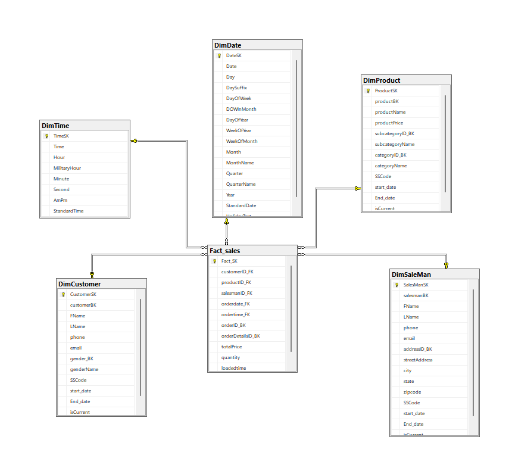
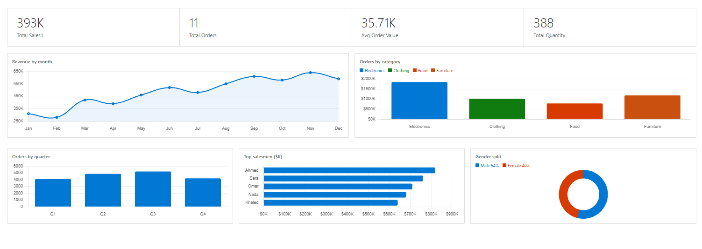

End-to-End Sales Data Warehouse Project

Overview
This project demonstrates the implementation of a complete **Business Intelligence (BI) lifecycle**, from data extraction to visualization.  

It was developed as part of my learning journey in the **Digital Pioneers Initiative**, where I followed a guided project to understand how modern data warehouses are designed and built in real-world scenarios.

> **Note:** This is a guided learning project. However, I focused on deeply understanding each component and implementing the solution with clarity and best practices.

---

Data Warehouse Architecture

The data warehouse follows a **Star Schema** design implemented in **SQL Server**, optimized for analytical queries.

Schema Components:
- **Fact Table:**
  - `Fact_sales`: Stores transactional sales data

- **Dimension Tables:**
  - `DimProduct`
  - `DimCustomer`
  - `DimSaleMan`
  - `DimDate`
  - `DimTime`

Schema Diagram

---

ETL Pipeline (SSIS)

The ETL process was built using **SQL Server Integration Services (SSIS)** to extract, transform, and load data efficiently.

Key Features Implemented:

#### 1. Slowly Changing Dimensions (SCD Type 2)
- Tracks historical changes in:
  - Customer data
  - Product data
- Maintains:
  - `Start_Date`
  - `End_Date`
  - `IsCurrent` flag

Incremental Loading
- Implemented using `LastModifiedDate`
- Ensures:
  - Efficient data refresh
  - Reduced processing time

Data Transformations
- **Lookup** → Match surrogate keys
- **Derived Column** → Create calculated fields
- **Data Conversion** → Handle data types
- **Union All** → Merge data streams

SSIS Data Flow

---

Temporal Modeling

Built advanced time-based dimensions using SQL:

DimDate
- Day, Month, Year
- Quarter & Fiscal Calendar
- Week of Year / Month
- Day of Week

DimTime
- Hour, Minute, Second
- AM/PM
- Standard vs Military Time

---

Power BI Dashboard

An interactive dashboard was created to visualize key business metrics.

KPIs Included:
- **Total Sales**
- **Total Orders**
- **Average Order Value**
- **Total Quantity**

Visual Insights:
- Revenue by Month
- Orders by Category
- Orders by Quarter
- Top Salesmen
- Gender Distribution

Dashboard Preview

---

Project Structure
├── sql_scripts/
│ ├── ddl/
│ └── etl_queries/
│
├── screenshots/
│ ├── schema.png
│ ├── dataflow.png
│ └── dashboard.png
│
└── README.md

---

Technologies Used

- **SQL Server**
- **SSIS (SQL Server Integration Services)**
- **Power BI**
- **T-SQL**

---

Learning Outcomes

Through this project, I gained hands-on experience in:

- Designing **Star Schema Data Warehouses**
- Building **ETL pipelines using SSIS**
- Implementing **Slowly Changing Dimensions (Type 2)**
- Applying **Incremental Data Loading strategies**
- Creating **Time-based Dimensions (Date & Time)**
- Developing **interactive dashboards in Power BI**
- Understanding the **end-to-end BI workflow**

---

Acknowledgment

This project was completed as part of a guided learning experience under the journey of learning Data Engineering , which helped me build a strong foundation in Data Engineering and Business Intelligence concepts.

---

Contact

Feel free to connect with me on LinkedIn or reach out for feedback or collaboration.
